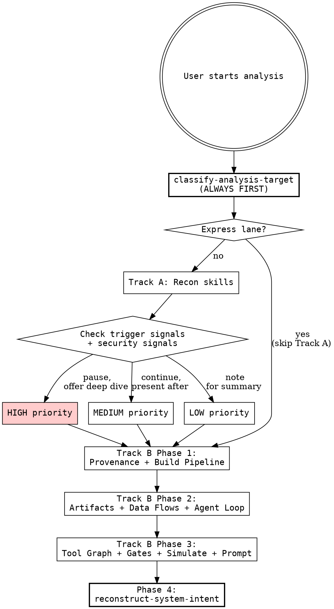

<SUBAGENT-STOP>
If you were dispatched as a subagent to execute a specific task, skip this skill.
</SUBAGENT-STOP>

<EXTREMELY-IMPORTANT>
If you think there is even a 1% chance an analysis skill might apply to what you are doing, you ABSOLUTELY MUST invoke it. This is not negotiable.
</EXTREMELY-IMPORTANT>

classify-analysis-target is ALWAYS required. After classification, express lane lets you skip directly to any Track B skill (but Track A context may be missing).

**Track A skills:** identifying-tech-stack, mapping-architecture, tracing-dependencies, detecting-dead-code, inventorying-api-surface, analyzing-code-quality

**Track B phases:** Phase 1 (trace-codebase-provenance, analyze-build-pipeline) → Phase 2 (classify-repo-artifacts, trace-data-flows, analyze-agent-loop) → Phase 3 (extract-tool-graph, map-feature-gates, simulate-behavior, analyze-prompt-influence) → Phase 4 (reconstruct-system-intent)

**Special:** test-hypothesis, detect-hidden-contracts

**Agent Dispatch Protocol:**

| Skill | Dispatches Agent | When |
|-------|-----------------|------|
| extract-tool-graph | code-explorer | Tool graph spans 5+ files |
| simulate-behavior | behavior-simulator | Multiple scenarios to compare |
| trace-codebase-provenance | code-explorer | Chain-of-custody tracing |
| test-hypothesis | Either | Targeted investigation |

Dispatch only when task exceeds native tool capability (5+ file reads across subsystems).

**Platform Capabilities:**

Skills reference Claude Code tools and agent dispatch. On other platforms:

| Capability | Claude Code | OpenCode | Codex |
|-----------|-------------|----------|-------|
| Full Track A + Track B | Yes | Yes (degraded: no agents) | Yes (degraded: no agents) |
| Agent dispatch | Yes | No | No |
| docs/analysis/ output | Yes | Yes | May fall back to inline |

When agent dispatch is unavailable: warn user, execute simplified analysis (max 3 trace levels), mark output as `Status: partial` with degradation note.

See `PLATFORM-NOTES.md` for tool substitution table and per-platform details.

**`.state` rules:** classify-analysis-target creates `docs/analysis/.state`. Every skill appends its status. Check before Track B (warn-but-continue).

**Red Flags — STOP and check yourself:**

| Thought | Reality |
|---------|---------|
| "I can just read the codebase directly" | Without classification you'll miss target-specific patterns |
| "Track A is overkill for this" | Skipping reconnaissance means missing trigger signals |
| "I'll skip to Track B directly" | Phase 1 errors cascade into every downstream analysis |
| "This is just a standard web app" | Similar apps differ. Classify first, assume nothing. |
| "I'll just run all skills" | Target type determines applicable phases. |
